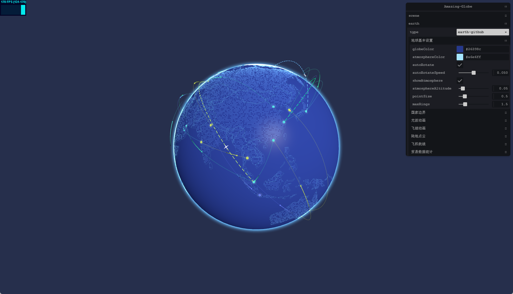

# GZCTF Viewing System — 3D CTF 竞赛实时观赛系统



基于 **Next.js + Three.js** 构建的 CTF（Capture The Flag）竞赛 3D 实时可视化观赛系统。将枯燥的记分板数据转化为生动的太空地球攻防场景，为 CTF 赛事提供沉浸式的观赛体验。

---

## 🚀 快速开始

```shell
# 安装依赖
npm install

# 启动开发服务器
npm run dev

# 构建生产版本
npm run build

# 启动生产服务
npm start
```

---

## ✨ 功能特性

### 🌍 3D 地球战场
- **高精度 3D 地球**：176 个国家边界线 + 45 个精选大国填充，支持国界线/填充独立透明度控制
- **双层渲染策略**：所有国家显示轮廓，主要大国有颜色填充，层次分明
- **自定义着色器**：地球大气层散射效果、动态光照

### 🚀 飞船排名系统
- **基于排名的固定轨道位置**：排名 1-3 低轨道（120° 间隔），排名 4-9 中轨道（60° 间隔），排名 10-20 高轨道
- **实名飞船标签**：超大字体队名/排名/分数显示，自适应 Canvas 宽度
- **平滑排名过渡**：排名变化时飞船平滑移动到新轨道位置，无跳跃感
- **设备自适应**：移动端最多 15 艘飞船，桌面端最多 20 艘

### ⚡ 四种攻击特效
每次 Flag 提交会随机触发以下四种攻击动画之一：

| 攻击类型 | 视觉效果 | 特点 |
|---------|---------|------|
| ⚡ 闪电链 | 折线形闪电，动态路径变化 | 随机闪烁，爆发力强 |
| 🌊 能量波纹 | 能量球 + 3 个扩散波纹环 | 平滑移动，涟漪效果 |
| 🌀 传送门 | 起点/终点双传送门 + 能量束 | 四阶段动画，科幻感 |
| 💫 粒子洪流 | 200 个粒子从飞船涌出 | 密集震撼，流动感强 |

- **弧形路径**：所有攻击沿贝塞尔曲线绕过地球，杜绝穿模
- **独立颜色映射**：13 种 Challenge 类别对应不同颜色
- **爆炸特效**：攻击命中后触发爆炸波纹

### 🎬 智能运镜系统
- **5 种运镜模式**：环绕地球、推进特写、俯冲运镜、螺旋上升、跟随飞船
- **自动展示**：每 5 分钟自动展示前三名飞船
- **运镜轮换**：每 3 分钟自动切换运镜模式

### 📊 实时数据面板
- **Team Rankings**：分组轮换显示（每组 10 队，15 秒切换）
- **Events Feed**：实时事件流，展示 Flag 提交动态
- **Top Teams Ability**：前三名能力雷达图
- **Countdown Timer**：比赛倒计时

### 🔐 GZCTF 认证集成
- 基于 Cookie 的自动认证
- 页面级认证保护，未登录自动跳转
- 24 小时自动过期

### 🎨 UI/UX
- **深空主题**：玻璃态面板、霓虹发光效果
- **响应式布局**：桌面端三栏布局
- **暗色/亮色主题**：支持主题切换

---

## 🏗️ 技术栈

| 类别 | 技术 |
|------|------|
| **框架** | Next.js 14（App Router） |
| **渲染** | React 18 |
| **3D 引擎** | Three.js 0.169 |
| **后期处理** | postprocessing |
| **动画** | GSAP 3.12 |
| **样式** | Tailwind CSS 3.4 |
| **UI 组件** | Radix UI (shadcn/ui) |
| **图表** | Recharts |
| **语言** | TypeScript |

---

## ⚙️ 配置说明

### 环境变量

```bash
NEXT_PUBLIC_API_BASE_URL=https://your-gzctf-server.com
```

### 默认比赛 ID

修改 `app/page.tsx` 中的重定向目标：

```tsx
redirect("/scoreboard/9")  // 改为你的比赛 ID
```

---

## 🎮 使用指南

1. 访问系统首页 → 自动跳转到计分板页面
2. 若未登录，跳转到登录页，输入 GZCTF 管理员账号
3. 登录成功后进入观赛主页面：
   - **中央**：3D 地球场景，飞船实时显示各队伍排名
   - **左侧**：分组轮换排名列表
   - **右侧**：事件流 + TOP3 能力面板

### 快捷键

| 快捷键 | 功能 |
|--------|------|
| `G` | 切换 GUI 调试面板 |
| 鼠标拖拽 | 旋转视角 |
| 滚轮 | 缩放 |

---

## 📝 开发说明

详细文档请参阅 [DEVELOPMENT.md](./DEVELOPMENT.md)。

---

## 👤 作者

- **asoutherncat** — [GitHub](https://github.com/asoutherncat)

---

## 📄 许可证

MIT License
